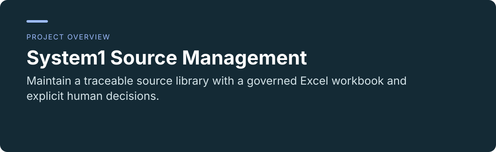
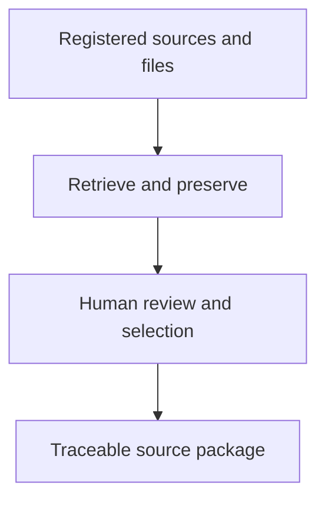

 

# System1 Source Management

**Maintain a traceable source library with a governed Excel workbook and explicit human decisions.**

[Project usage and maintenance](../README.md) · [Report an issue](https://github.com/thejaytang/system1-source-management/issues)

## 1. What you can do

- Keep source identity, retrieval state, selection and review decisions distinct.
- Retain original files and provenance for downstream Requirement work.

## 2. Start here

Follow the [operator guide](../README.md#first-time-setup) to create the project environment and run validation. The workbook, Data and Code folders form one package.

## 3. Use cases

These are illustrative scenarios. Only explicitly linked execution artifacts represent checks performed for this update.

| Input or request | Expected result |
|---|---|
| A registered source or authorized file | A governed record and preserved original snapshot |
| An unresolved source decision | A visible human task and recorded resolution |

## 4. Requirements and current limits

Workbook-centered System1 package. Requires Python 3.11+, Excel 365/2021 and the project-local environment. It does not deliver an integrated Requirement-extraction runtime or legal interpretation. The separate Smarter Compliance repository presents a browser workbench; use each repository’s own guide rather than assuming data or launcher compatibility.

## 5. Documentation and sources

These links identify the implementation, operating instructions or related projects for a closer fit check.

- [Operator guide](../README.md)
- [Engineering guide](../Code/README.md)
- [Browser workbench](https://github.com/thejaytang/smarter-compliance-aquaculture)

## 6. License and maintenance

No repository-wide license is declared at the root. This presentation update does not change the terms of code, data or third-party material; confirm permission for the material you want to reuse.

This is the public introduction. Linked project documents remain authoritative for operation, constraints and maintenance. Presentation updated: 2026-09-22.
