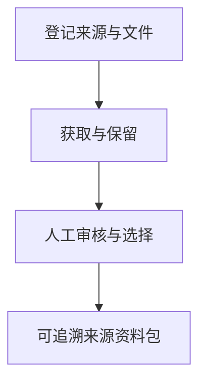

 

# System1 Source Management

**通过受控 Excel 工作簿和明确的人工决定，维护可追溯来源库。**

[项目使用与维护入口](../README.md) · [报告问题](https://github.com/thejaytang/system1-source-management/issues)

## 1. 能完成什么

- 区分来源身份、获取状态、选择结果与审核决定。
- 为下游 Requirement 工作保留原始文件与来源记录。

## 2. 从这里开始

按[操作指南](../README.md#first-time-setup)建立项目环境并运行检查。工作簿、Data 和 Code 目录构成一个整体资料包。

## 3. 使用场景

以下为说明性场景；只有明确链接的运行产物才代表本次检查结果。

| 输入或请求 | 预期结果 |
|---|---|
| 已登记来源或获准文件 | 受控记录与保留的原始快照 |
| 尚未解决的来源决定 | 可见的人工任务及处理记录 |

## 4. 使用条件与当前边界

以工作簿为中心的 System1 资料包，需要 Python 3.11+、Excel 365/2021 和项目本地环境。它不包含完整集成的 Requirement 提取运行流程，也不提供法律解释。另一个 Smarter Compliance 仓库提供浏览器工作台，应各自遵循所属指南，不假定数据或启动器相互兼容。

## 5. 资料与来源

下面链接指向实现、操作说明或相关项目，便于进一步判断适用性。

- [操作指南](../README.md)
- [工程指南](../Code/README.md)
- [浏览器工作台](https://github.com/thejaytang/smarter-compliance-aquaculture)

## 6. 许可与维护

仓库尚未在根目录声明统一许可证；本次展示更新没有改变代码、数据或第三方材料的许可。复用前请确认对应材料的授权。

本页为对外介绍。具体操作、约束和维护说明以链接的项目文档为准。展示页更新：2026-09-22。
